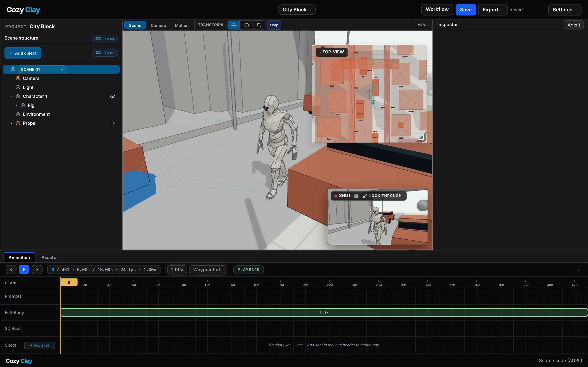

<p align="center">
  
</p>

<p align="center">
  <em>Block a scene, pose the cast, cut the camera — in a browser tab.</em>
</p>

<p align="center">
  Created and maintained by <a href="https://github.com/HaD0Yun">Doyun</a> at <a href="https://github.com/NomaDamas">NomaDamas</a>.
</p>

<p align="center">
  <a href="LICENSE"></a>
  <a href="https://www.npmjs.com/package/cozyclay"></a>
  
  <a href="https://github.com/NomaDamas/CozyClay/stargazers"></a>
</p>

<p align="center">
  <a href="https://cozyclay.org/#try">Try it in the browser</a> ·
  <a href="#quick-start">Quick start</a> ·
  <a href="#what-you-can-do">Features</a> ·
  <a href="#ai-control">AI control</a> ·
  <a href="#workflow-canvas">Workflow</a> ·
  <a href="#controls">Controls</a> ·
  <a href="#documentation">Docs</a> ·
  <a href="https://github.com/NomaDamas/CozyClay/issues">Issues</a>
</p>

---



**Live:** https://cozyclay-superui.vercel.app/app/ (this fork's deployment, opened on the starter scene with `?scene=city-block`)

CozyClay is a browser-based previs studio built with Three.js and React Three Fiber. Block a scene, pose the cast, cut the camera on a timeline, then hand the same shot to an AI video model (Seedance, Kling, Veo, or your own) as a first frame, a reference clip, or a prompt — all from one local workspace. The keyframe pack's greybox clip is the input Seedance 2.5 documents as white-model control: "Use the white-model reference video as the sole guide for camera movement, pacing, framing, subject motion, and blocking" (seed.bytedance.com/en/seedance2_5). MiniMax H3, Wan 3.0, LTX Desktop and fal render-to-real take the same plain RGB clip.

```bash
npx cozyclay
```

That is the whole install. Not sure yet? **[Try it in the browser first](https://cozyclay.org/#try)** — a seven-step camera tutorial on a live scene — then keep going on your machine with the same set:

```bash
npx cozyclay --scene city-block
```

The studio ships seeded with a pre-generated motion clip, so you can scrub the timeline, drive the cameras and draw a dolly rail straight away — generating *new* motion is optional and uses the Kimodo bridge when configured.

## Demo

https://github.com/user-attachments/assets/1d0113e5-6922-443d-affc-1bdabc666247

## What you can do

|  | |
| --- | --- |
| **Stage a scene** | Create primitives and set pieces, then move, rotate and scale them with the transform strip's gizmo. Grid snapping is a preference, not a law — hold `Ctrl` mid-drag to invert it. A bird's-eye Top-View drives 2D root waypoints for character paths. **View ▾** on the viewport bar holds the reference grid and Auto Color — Blender's random viewport color, so twenty grey blockout boxes stay tellable apart without touching the colors you authored (captures include the display colors while it is on). |
| **Fly the camera** | Right-drag flies (WASD walks, Q/E cranes), middle-drag pans, Alt+drag orbits the selection, click selects, `F` frames — the muscle memory you already have from a 3D editor. Fly, pan and orbit lock the pointer for the hold, so the view can turn past the window edge. Selecting the camera switches to Camera mode. **Look through** in the Shot monitor puts you behind the shot camera with the same bindings; click the on-screen **Shot camera** indicator or press `Esc` to return to the free camera. |
| **Cut and move the camera** | Add shots on the timeline, draw a dolly rail on the Top-View, set speed, height and crane, and preview the move through the shot camera. Each shot carries a **Target model** (Seedance 2.5, Kling 2, Veo 3, self-hosted MiniMax-H3) and is flagged when the cut runs past that model's limits. |
| **Export for AI video** | One **Export ▾** menu: a keyframe pack (first/last frame, clip, camera JSON, prompt, README) as a zip, an mp4 of the shot, depth + normal conditioning passes, a storyboard contact sheet, and an OTIO cut list. Seedance 2.5 reads the pack's greybox clip as its white-model reference video, and MiniMax H3, Wan 3.0, LTX Desktop and fal render-to-real accept the same clip. The **Shot Prompt** turns the framing into a structured prompt for the model you picked. |
| **Undo anything** | Every scene mutation goes through one history store: a drag, a scrub, an inspector edit, an agent's camera key is exactly one undo entry. `Esc` cancels an in-flight drag and restores the pre-drag transform. |
| **Generate motion** | Pose characters and export poses, sequence multi-phase motion as Prompt Blocks on a resizable timeline, send them to Kimodo, then play the result back with sparse IK correction where the generated motion needs fixing. Draw over a joint's trail to reshape a take, keep most of it and regenerate a window, and step back through its history. |
| **Capture motion from video or a photo** | Drop a clip or a still: the GPU box runs [GVHMR](https://github.com/zju3dv/GVHMR) and the result is retargeted onto the character with stabilisation, contact correction and a quality gate. |
| **Direct it with an AI** | Open the **Agent panel** (`Cmd/Ctrl+B`), sign in with your ChatGPT account, and ask for a shot in plain language; the conversation survives reloads and you can paste a reference screenshot into it. Or connect Claude — or any MCP client — or drive the Studio from a terminal with `cclay live`. All three place the cast, frame "a low wide profile", generate multi-phase motion, and the viewport moves in front of you. See [AI control](#ai-control). |

## Quick start

You need Node.js 22.19 or newer, npm or bun, and a Chromium-based browser.

```bash
npx cozyclay
# or
bunx cozyclay
```

That downloads the built studio and opens it at `http://127.0.0.1:5180/app/`. Nothing to compile, no dependency tree to install. Useful flags: `--port 5200`, `--no-open`, `--no-motion`, `--scene city-block` (start on the bundled starter scene instead of an empty room; the first-run dialog offers the same under **Start from a scene**, and a `.cclayproject` downloaded from the browser tutorial opens with **Open a project**).

A global install gives you `cclay`, the same command with less typing. Once a day the launcher checks npm for a newer release and prints a one-line notice after the studio is up; it stays quiet when you're current or offline. `cclay update` installs the latest release, and `--no-update-check` skips the check entirely.

New to the camera? The seven-step tutorial runs inside the Studio on the City Block set: **Settings ▾ → Camera tutorial**, or open `http://127.0.0.1:5180/app/?tutorial=camera`. Each step points at the control it needs and completes only when you actually make the move.

### This fork

This repository is a fork of [NomaDamas/CozyClay](https://github.com/NomaDamas/CozyClay). On top of upstream it restyles the Studio on Minimal Design System tokens and adds two gates, `npm run check:tokens` and `npm run audit:contrast`. The `npx cozyclay` command and the npm badge above refer to the upstream package, which does not include the restyle. To see the fork's styling, use the live link at the top or run from source.

### From source

```bash
git clone https://github.com/weeeha/CozyClay-SuperUI.git
cd CozyClay-SuperUI
npm install
npm run dev
```

Open `http://127.0.0.1:5180/app/` for the Studio (the root redirects there) and `http://127.0.0.1:5180/workflow/` for the Workflow canvas. `npm run dev` starts the studio together with its local Kimodo bridge once `CCLAY_KIMODO_HOST` points at a GPU box; without that variable it starts the studio alone and says so. `npm run dev:ui` starts the browser UI alone in every case.

### Motion generation

Generating new motion needs Kimodo on a machine you can reach. Point the Studio at it and install the worker once:

```bash
CCLAY_KIMODO_HOST=user@your-gpu-box npm run kimodo:setup
CCLAY_KIMODO_HOST=user@your-gpu-box npx cozyclay
```

The installer detects OS, architecture, RAM and CUDA and picks the best-supported backend for that host — kimodo-mlx on a big Apple Silicon machine, kimodo.cpp with Metal or CPU otherwise, the upstream PyTorch stack on NVIDIA. An SSH-accessible NVIDIA box is the classic target and the only route with the full feature set; the same box runs GVHMR for video and photo mocap. Routes, overrides and local-only limits are in [`docs/kimodo-setup.md`](docs/kimodo-setup.md).

## AI control

Three surfaces drive the same scene, live, through one hub: a chat panel in the Studio, an MCP server for external assistants, and a terminal CLI.

### Agent panel in the Studio

**View ▾ → Panels → Agent panel** (or `Cmd/Ctrl+B`) opens a chat column that signs in with your ChatGPT account (Codex OAuth; the token lives in `~/.config/cozyclay/`) and works the scene in front of you:

> "Put a detective and a courier in an alley, give me a low wide profile shot,
> then make her stand up from the chair, sprint, and trip."

- Every change comes back as a receipt that highlights the Inspector and hierarchy rows it touched, and `Cmd/Ctrl+Z` takes it back like any other edit.
- The conversation is stored under `~/.config/cozyclay/agent-sessions/` and resumes across reloads and restarts; **History** lists earlier sessions.
- Paste or drop up to four images into the composer — a reference frame, a storyboard panel — and they go with the turn.
- The agent has nine Studio tool families, from `inspect_studio` and `arrange_characters` to `patch_elements`, which sets any declared authored field (a character's tint, a shot's target model, the key light) by path. How it turns a pasted video prompt into blocking — what it asks, infers, or leaves empty — is the rule in [`docs/agent-prompt-to-scene.md`](docs/agent-prompt-to-scene.md).

The panel is not tied to ChatGPT. Models come from six providers: ChatGPT (your Codex sign-in), Anthropic, OpenAI, Google Gemini, OpenRouter and CLIProxyAPI. A model id reads `provider/model`, so you pick one in the dropdown and that is where the turn goes. The five API-key providers take a key from an environment variable (`ANTHROPIC_API_KEY`, `OPENAI_API_KEY`, `GEMINI_API_KEY` or `GOOGLE_API_KEY`, `OPENROUTER_API_KEY`, `CLIPROXY_API_KEY`) or from `~/.config/cozyclay/providers.json`, written at mode 0600 and never echoed back by any route; ChatGPT still signs in the way it always did. On the Workflow canvas you can steer a turn while it runs instead of stopping it. Conversations are saved in a new transcript format, so sessions recorded before this version are ignored rather than converted: the old files stay on disk, unread. The provider table, the key routes, the steer route and the session format are in [`docs/agent-cli.md`](docs/agent-cli.md).

The agent runs on [pi](https://github.com/earendil-works/pi), an open-source agent harness: `@earendil-works/pi-ai` and `@earendil-works/pi-agent-core` (MIT) are the only runtime dependencies the package declares, and the sidecar loads them lazily, when a turn starts.

The same panel sits on the right of the Workflow canvas, where it builds and runs canvas nodes.

### MCP server

The studio ships an [MCP](https://modelcontextprotocol.io) server, so any MCP client can drive it — the same scene, the same viewport:

```json
{
  "mcpServers": {
    "cozyclay": {
      "command": "npx",
      "args": ["-y", "cozyclay", "mcp"]
    }
  }
}
```

Drop that into `claude_desktop_config.json` (or any MCP client config) and restart the client. The first run automatically installs the MCP SDK's 95-package tree; opening the studio never waits on it, so those dependencies are fetched only when you actually want the server.

- **Editor open?** Tool calls move the visible viewport — camera, cast, set, generated motion, prompt blocks on the timeline.
- **No editor?** Scene and project tools run headless: block scenes, derive film vocabulary ("wide shot · right profile · knee level · 24mm"), render AI video prompts, and write `.cclayproject` files. `capture_frame`, `set_prompt_blocks`, `generate_motion`, and `apply_batch` require the live editor.

Tools, transports and the live-control protocol are documented in [`mcp/README.md`](mcp/README.md).

### From a terminal

`cclay live` is a small CLI that reads the scene, places and moves things, frames and keys shots, patches declared fields (`cclay live patch --target stage --set '{"keyLight.intensity":2.4}'`), verifies the result with a capture PNG, and undoes by receipt — one JSON object per command, stable error codes, no browser of your own required (only the studio tab itself). It is the intended surface for a coding agent that has to manage a running Studio. The full guide, with three worked sessions against a real editor, is in [`docs/agent-cli.md`](docs/agent-cli.md).

## Workflow canvas

The Workflow canvas at `http://127.0.0.1:5180/workflow/` is a node editor around the Studio: a **CozyClay Scene** node with a live viewport that previews the shot camera, a **Shot Prompt** node that builds a structured prompt from the capture, **Image** nodes (versions, A/B, pinned references) and a **Video** node that runs through your own ComfyUI (`COZYCLAY_COMFY_URL`) or fal (`FAL_KEY`) — bring your own key, nothing is proxied. Graphs are saved in the browser and execute locally.

## Controls

| Input | Action |
| --- | --- |
| Right-drag | Look around (fly) |
| RMB + WASD | Walk while flying |
| RMB + Q/E | Crane down / up |
| RMB + Shift | Boost fly speed 2.6× |
| Middle-drag | Pan |
| Alt + drag | Orbit the selection |
| Scroll | Dolly; while flying, sets the fly speed instead |
| Click | Select; empty space clears |
| Transform strip | Move / rotate / scale tool, snap |
| Ctrl/Cmd (during drag) | Invert grid snapping |
| Ctrl/Cmd+Z, Ctrl/Cmd+Shift+Z | Undo / redo |
| Esc | Cancel the in-flight drag |
| End | Drop the selection to the surface |
| Ctrl/Cmd+D | Duplicate the selection |
| Delete / Backspace | Delete the selection |
| F | Frame the selection |
| Look through / Esc | Fly / leave the shot camera |
| Cmd/Ctrl+B | Show / hide the Agent panel |

Every control's home is recorded in [`docs/studio-ui-ia.md`](docs/studio-ui-ia.md), with the rule behind each placement.

## Documentation

| Read | For |
| --- | --- |
| [`docs/kimodo-setup.md`](docs/kimodo-setup.md) | Installing Kimodo: the route table, CUDA over SSH, local MLX/Metal/CPU generation and what each route supports |
| [`docs/agent-cli.md`](docs/agent-cli.md) | Driving the Studio from a terminal with `cclay live` |
| [`docs/agent-prompt-to-scene.md`](docs/agent-prompt-to-scene.md) | The ask / infer / omit rule the Agent follows when turning a video prompt into blocking |
| [`mcp/README.md`](mcp/README.md) | MCP tools, transports, and the live-control protocol |
| [`docs/studio-ui-ia.md`](docs/studio-ui-ia.md) | Where every Studio control lives and why |
| [`docs/privacy.md`](docs/privacy.md) | The full analytics disclosure: events, identifiers, opt-out, internal QA marking |
| [`workers/api/README.md`](workers/api/README.md) | The hosted demo on cozyclay.org: queue policy, the Cloudflare Worker and the GPU-box poller |
| [`docs/releasing.md`](docs/releasing.md) | Publishing a signed npm release |
| [`CHANGELOG.md`](CHANGELOG.md) | What changed in each release |

Longer reads on the site: [Greybox to AI video](https://cozyclay.org/greybox-to-video/), [Seedance 2.5 camera control](https://cozyclay.org/seedance-camera-control/), [Camera control for AI video](https://cozyclay.org/ai-camera-control/), [Previs software compared](https://cozyclay.org/previs-software/).

## Validate

| Command | Covers |
| --- | --- |
| `npm run test:history` | Undo/redo store and transaction coordinator |
| `npm run test:scene-objects` | Scene-object model |
| `npm run test:hierarchy` | Hierarchy panel model |
| `npm run test:objects` | Gizmo interaction in a real browser — needs `npm run dev:ui` in another shell |
| `npm run test:theme` / `test:appearance` / `test:layout` | UI theme, appearance, layout |
| `npm run test:lifecycle` | Dev-server process lifecycle |
| `npm run test:ardy` | Motion conversion, playback, and IK pipeline |
| `node tools/run-tests.mjs` | Every Node verification file (what CI runs) |
| `npm run qa:browser -- node test/qa-camera-tutorial-browser.mjs` | The seven-step tutorial driven with real input, beacons pinned to their controls |
| `QA_URL=… CDP_PORT=… OUT=/tmp/count npm run qa:browser -- node tools/qa/studio-control-count.mjs` | Simultaneously visible controls per mode (budget: Scene ≤35 / Camera ≤38 / Motion ≤52) |
| `cd mcp && npm install && npm run verify` | MCP server over real stdio — all 420 framing combinations |
| `cd mcp && npm run verify:live` | Live-control protocol against a fake editor (same `npm install` first) |
| `npm run build` | Production build |

Ad-hoc browser QA, while a dev server is available (the browser opens the studio at `/app/`):

```bash
npm run qa:browser -- node <qa-script>
```

## Contributing

Found something broken, or want a feature? [Open an issue](https://github.com/NomaDamas/CozyClay/issues) — bug reports with a repro are the most useful thing you can send. Contributions are accepted under `AGPL-3.0-or-later`.

**Repository hygiene.** Generated motion archives, QA output, build output, logs and local runtime artifacts are not source files and must not be committed. Keep `tools/ardy/out/`, `artifacts/`, `dist/`, `.gjc/` and `.npz` files local.

Every runtime library except the two agent packages (`@earendil-works/pi-ai`, `@earendil-works/pi-agent-core`) intentionally lives in `devDependencies`, because the published npm package ships the prebuilt `dist/`, so `npx cozyclay` must not install the studio's dependency tree.

## Analytics & privacy

Anonymous usage counts, no cookies, no recordings, never your project content — on the hosted site via PostHog and in the official npm package, which prints the disclosure once on first launch. Source checkouts, forks, dev servers, CI and tests send nothing.

```bash
cclay telemetry status
cclay telemetry off
```

`COZYCLAY_TELEMETRY=0` or `DO_NOT_TRACK=1` disables collection for a launch; **Settings ▾ → Privacy** is the same switch inside the Studio. The event list, what each identifier is, how internal QA traffic is marked and the first-edit definition are in [`docs/privacy.md`](docs/privacy.md).

## Hosted demo

Installing a GPU motion backend is the hard part, so `cozyclay.org` also runs a queued demo: a visitor writes one prompt, gets a ticket link, and a GPU box owned by the maintainer generates the motion and uploads it — the result opens in the studio itself. The composer pages, the Cloudflare Worker queue API and the GPU-box poller all live in this repository; the queue policy and runbooks are in [`workers/api/README.md`](workers/api/README.md).

## License & credits

GNU Affero General Public License v3.0 or later — see [`LICENSE`](LICENSE) and the transition details in [`LICENSING.md`](LICENSING.md). Modified network services must offer their users the corresponding source. Third-party projects retain their own licenses and copyright; see [`THIRD_PARTY_NOTICES.md`](THIRD_PARTY_NOTICES.md).

The hosted demo worker may use an externally installed [NVIDIA ARDY](https://github.com/nv-tlabs/ardy) runtime. ARDY is a separate third-party project owned and maintained by NVIDIA; it is not included in this repository, and CozyClay is not affiliated with or endorsed by NVIDIA. The local Studio uses Kimodo instead.
